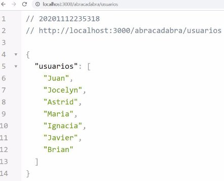
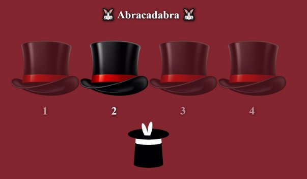

# Desafío - Abracadabra

Desarrollar un servidor con Express que sirva un sitio web estático con temática de magia, donde se presenten 4
sombreros y al hacer click en uno de estos encontrar el conejo oculto.

El servidor deberá disponibilizar las siguientes rutas:

- **/abracadabra/usuarios**: Se debe devolver un JSON con un arreglo de nombres alojado en el servidor.
- **/abracadabra/juego/:usuario**: : A través de un middleware, verificar que el usuario escrito como parámetro existe
  en el arreglo alojado en el servidor.
- **/abracadabra/conejo/:n**: Basado en un número aleatorio del 1 al 4, devolver la foto del conejo en caso de coincidir
  con el número recibido como parámetro ó devolver la foto de Voldemort en caso de no coincidir.

## Comenzando 🚀

_Estas instrucciones te permitirán obtener una copia del proyecto en funcionamiento en tu máquina local para propósitos de desarrollo y pruebas._

- $ cd ../path/to/the/file
- $ npm install
- $ node index.js

### Requerimientos

1. Crear un servidor con Express en el puerto 3000.
2. Definir la carpeta “assets” como carpeta pública del servidor.
3. Crear en el servidor un arreglo de nombres y devolverlo en formato JSON a través de
   la ruta /abracadabra/usuarios.
4. Crear un middleware con la ruta /abracadabra/juego/:usuario para validar que el
   usuario recibido como parámetro “usuario” existe en el arreglo de nombres creado
   en el servidor.
   En caso de ser exitoso, permitir el paso a la ruta GET correspondiente, de lo contrario
   devolver la imagen “who.jpeg”.
5. Crear una ruta /abracadabra/conejo/:n que valide si el parámetro “n” coincide con el
   número generado de forma aleatoria.
   En caso de ser exitoso, devolver la imagen del conejo, de lo contrario devolver la
   imagen de Voldemort.
6. Crear una ruta genérica que devuelva un mensaje diciendo “Esta página no existe...”
   al consultar una ruta que no esté definida en el servidor.

##### Las siguientes imágenes representan las interacciones que debe tener el sitio web una vez terminado el desafío.

# Demostración del JSON

# Interfaz de la aplicación cliente

# Imagen que se debe devolver en caso de escribir una ruta inexistente

# Si se hace click en un sombrero cuyo número no coincide con el número generado en el servidor de forma aleatoria, se debe devolver la imagen de Voldemort.

# Si se hace click en un sombrero cuyo número sí coincide con el número generado en el servidor de forma aleatoria, se debe devolver la imagen del Conejo

## Construido con 🛠️

- [nodeJS](https://nodejs.org/en/)

#### Usando las librerías:

- [Express](https://expressjs.com/es/)

## Autores ✒️

- **Arlene Santos**
- **Eric LEiva**
- **Diego Madariaga**
- **Mario Montenegro**
